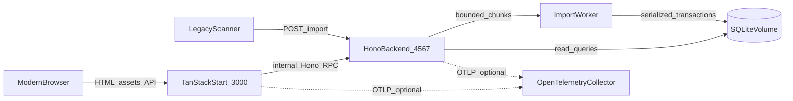
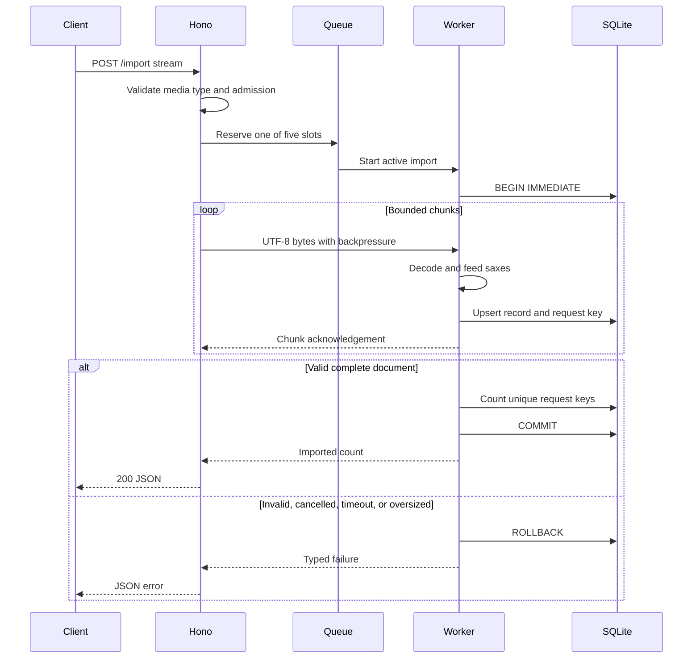
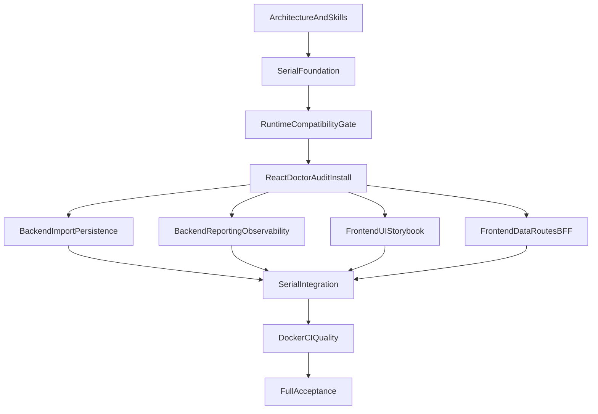

# Markr Architecture

## 1. Status and authority

This document defines the implementation architecture for Markr. [`REQUIREMENTS.md`](REQUIREMENTS.md) remains authoritative for product behavior; this document explains how the selected system will satisfy it. Trade-offs and rationale are recorded in [`NOTES.md`](NOTES.md).

The architecture is production-minded but deliberately proportional to the supplied acceptance scale. It provides clean boundaries, deterministic tests, observability, security defaults, and a documented production evolution path without pretending that local SQLite is a horizontally scalable production database.

## 2. Goals

- Satisfy every requirement while keeping API and UI behavior testable.
- Keep scanner-facing HTTP, browser-facing UI, import processing, and persistence as explicit boundaries.
- Preserve atomic imports without buffering a 50 MiB XML tree.
- Keep the browser same-origin while leaving the backend directly reachable for scanners and compliance tests.
- Make runtime failures, import contention, stale dashboards, and operational state visible without logging student data.
- Allow narrow implementation agents to work in parallel without sharing mutable files.
- Keep the SQLite implementation migration-aware while describing, not falsely claiming, PostgreSQL compatibility.

## 3. Non-goals

- Authentication, TLS termination, application rate limiting, deletion, and retention automation remain out of scope under SCOPE-006 through SCOPE-008 and NFR-006.
- The initial implementation does not ship a PostgreSQL adapter or PostgreSQL migrations.
- The initial implementation does not provide horizontal backend scaling.
- Visual-regression SaaS, React Doctor CI, browser E2E in CI, and Kubernetes manifests are deferred.
- No application code may depend on instructions embedded in `task/` comments except COMP-001 and COMP-002.

## 4. System context



### 4.1 Runtime containers

- **Frontend service:** TanStack Start SSR server on port 3000. It serves pages/assets, performs initial server data loads, and exposes a thin same-origin `/api/*` proxy.
- **Backend service:** Hono HTTP API on port 4567. It owns validation, result behavior, queries, health, and the import worker.
- **Migration service:** one-shot process using the backend image and shared SQLite volume. Backend startup waits for successful completion.
- **SQLite volume:** local persistent filesystem volume. It survives ordinary Compose down/up and supports one backend instance.
- **OpenTelemetry Collector:** optional Compose profile. Neither readiness nor core behavior depends on it.

## 5. Repository layout

The implementation will use this target structure:

```text
.
├── .agents/skills/              # reviewed third-party project skills
├── .cursor/
│   ├── mcp.json
│   └── skills/                  # Markr-specific Cursor skills
├── .github/workflows/
├── backend/
│   ├── drizzle/
│   ├── src/
│   │   ├── config/
│   │   ├── db/
│   │   ├── features/
│   │   │   ├── health/
│   │   │   ├── import/
│   │   │   └── results/
│   │   ├── observability/
│   │   ├── app.ts
│   │   └── server.ts
│   └── tests/
├── frontend/
│   ├── .storybook/
│   ├── src/
│   │   ├── components/ui/
│   │   ├── features/
│   │   │   ├── test-detail/
│   │   │   ├── test-list/
│   │   │   └── upload/
│   │   ├── lib/api/
│   │   ├── mocks/
│   │   ├── observability/
│   │   ├── routes/
│   │   └── styles/
│   └── tests/
├── task/                        # immutable source material
├── ARCHITECTURE.md
├── REQUIREMENTS.md
├── NOTES.md
├── PLAN.md
├── docker-compose.yml
├── pnpm-workspace.yaml
├── turbo.json
└── package.json
```

Route trees and other generated framework outputs are generated by tooling and never hand-edited by feature agents.

## 6. Workspace and toolchain

Architecture decision: [`NOTE-ARCH-001`](NOTES.md#note-arch-001).

- pnpm is the only dependency installer. Bun is a runtime, not a second package manager; no `bun.lock` is committed.
- Turborepo provides dependency-aware `dev`, `build`, `typecheck`, `lint`, `format:check`, `test`, `coverage`, and Storybook task graphs.
- `packageManager`, `engines`, `.node-version`, and `.bun-version` pin the toolchain; Docker and CI use the same values.
- Dependencies use normal semver ranges; `pnpm-lock.yaml` is committed and CI uses `--frozen-lockfile`.
- All workspace code is ESM-only.
- Shared TypeScript defaults enable `strict`, `noUncheckedIndexedAccess`, `exactOptionalPropertyTypes`, `noImplicitOverride`, and consistent path casing.
- Oxfmt formats and Oxlint performs static linting. TypeScript remains the type checker. React Doctor and Storybook/axe cover React and accessibility-specific checks not provided by Oxc.

### 6.1 Runtime compatibility gate

Bun is accepted only after the serial foundation agent proves all of the following in small executable spikes:

1. TanStack Start builds, serves SSR, hydrates, and streams the proxy under Bun.
2. Hono exports stable RPC types while `Bun.serve` handles the required body and shutdown behavior.
3. Drizzle migrations, WAL settings, transactions, and the `bun:sqlite` driver behave as designed.
4. Node-hosted Vitest can spawn, health-check, and terminate the real Bun service.
5. evlog emits correctly and OTLP export is optional.
6. OpenTelemetry parent/child context survives asynchronous Hono, worker, and proxy paths in integration tests.

If any service cannot meet its gate without fragile runtime patching, both runtime services switch to Node LTS for consistency. The database driver then becomes Drizzle's `node:sqlite` adapter. Architecture boundaries, routes, SQL semantics, tests, and container topology stay unchanged.

## 7. Frontend architecture

Architecture decisions: [`NOTE-ARCH-002`](NOTES.md#note-arch-002), [`NOTE-ARCH-003`](NOTES.md#note-arch-003).

### 7.1 Rendering and routing

- TanStack Start server-renders `/`, `/tests`, and `/tests/:test-id`.
- Route files own path/parameter validation, loader orchestration, and route-level error/not-found boundaries only.
- Page components live in feature directories and accept explicit state/callback props so every state can render in Storybook without a live router or backend.
- The server serializes TanStack Query state; hydration reuses the same cache rather than performing an immediate duplicate request.
- React Server Components and other experimental Start features are not used.

### 7.2 API boundary

The backend exports `AppType` from a side-effect-free Hono app module. Frontend compilation imports this type only and creates Hono RPC clients with environment-specific base URLs:

- SSR loaders use the private backend URL on the Compose network.
- Browser queries use same-origin `/api`.
- The frontend proxy strips `/api` and forwards to the backend's unchanged public paths.

The proxy:

- streams request and response bodies rather than parsing or buffering XML;
- forwards method, query, content type, conditional request headers, request ID, and W3C trace context;
- strips hop-by-hop and unnecessary client headers;
- enforces same-origin browser requests;
- uses a 120-second import timeout and ten-second query timeout;
- maps unavailable/upstream failures to structured JSON gateway errors; and
- forwards backend ETag, cache, content type, request ID, and trace headers.

The browser never needs a public backend environment variable. Backend port 4567 remains directly available to scanners, curl examples, integration tests, and the compliance suite. Backend CORS stays disabled.

### 7.3 Query and live-state model

TanStack Query owns server data. Query option factories are colocated by feature and consume the typed Hono client.

- SSR route loaders call `ensureQueryData`.
- List, aggregate, and histogram queries poll every five seconds after hydration.
- Query requests send `If-None-Match` when an ETag exists and preserve cached data on 304.
- Separate aggregate and histogram requests are allowed to be eventually consistent when an import commits between them. The next poll repairs the transient mismatch.
- Retry policy distinguishes initial failure, stale refresh, 404, and retryable 500-class errors.
- Polls are cancelled when routes unmount or the tab becomes inactive where browser behavior permits.

An explicit live-state reducer—not render timing—controls announcements:

- establish initial data silently;
- compare stable displayed data, not request frequency;
- announce list/detail changes once;
- announce the stale transition once;
- continue retrying without repeated alerts;
- announce recovery once; and
- keep `last refreshed` outside live regions.

Dates and percentages use `en-AU`. Visible refresh timestamps use `en-AU` formatting in the viewer's local timezone with an explicit timezone label (client-rendered after poll settle to avoid SSR/client timezone mismatch).

### 7.4 UI system

- React Aria Components provide interactive controls such as buttons and file-trigger behavior.
- Native semantic elements remain preferred for headings, tables/lists, links, status, alerts, definition lists, and time values.
- Tailwind supplies utility styling and CSS design tokens; `tailwind-variants` defines typed variants and React Aria `data-*` states.
- Tokens define warm neutral surfaces, restrained blue accents, status colors, typography, spacing, radii, borders, focus rings, and chart scale.
- `prefers-color-scheme` drives light/dark tokens without a hydration-sensitive JavaScript toggle.
- `prefers-reduced-motion` removes or makes transitions instantaneous.
- No gradients, glass effects, animated decoration, dense control panels, or faux-technical styling are used.

The histogram is a semantic `<figure>` containing a labelled list. Each list item contains range/count text and a CSS Grid bar. Height is visual enhancement only; range and count remain available in the accessibility tree and do not depend on color.

### 7.5 Storybook and MSW

Storybook uses the dedicated TanStack React framework at the same locked version across all Storybook packages.

- Application and Storybook share global tokens/styles but maintain separate Vite composition.
- CSF3 stories are colocated with components and page screens.
- Stories cover empty, loading, populated, success, invalid input, server error, network error, stale, recovery, changed data, not found, reduced motion, light, and dark states where applicable.
- Shared pure fixture builders and MSW v2 handler factories live under `frontend/src/mocks`.
- Storybook uses `mswLoader`; unit/browser tests reset handlers and treat unhandled API requests as failures.
- MSW is never active in production or full-stack browser acceptance.
- Storybook interaction tests use its Vitest browser integration and Testing Library semantics.
- Automated axe violations fail tests, but manual keyboard and screen-reader review remains required.
- CI builds and uploads static Storybook. Visual snapshot gating is deferred; Chromatic is the intended future path.

## 8. Backend architecture

Architecture decisions: [`NOTE-ARCH-004`](NOTES.md#note-arch-004), [`NOTE-ARCH-005`](NOTES.md#note-arch-005).

### 8.1 Application composition

`createApp(dependencies)` returns the typed Hono app without opening a socket. This supports Hono RPC typing and deterministic unit tests. `server.ts` owns configuration, telemetry startup, database/read connection, import worker, listener lifecycle, signals, and graceful shutdown.

Feature modules contain:

- route definitions and response mapping;
- application operations;
- persistence/query functions local to the feature; and
- unit/integration fixtures.

Shared infrastructure is limited to configuration, database setup, error mapping, request context, and observability. Drizzle types do not cross into frontend code.

### 8.2 Middleware order

The effective request pipeline is:

1. accepted/generated `x-request-id`;
2. W3C trace extraction and request span;
3. evlog request scope with redaction;
4. security and response headers;
5. route-appropriate timeout and import admission;
6. route handler;
7. centralized typed error-to-JSON mapping; and
8. metric/log/span completion.

No middleware captures bodies. High-cardinality route parameters use normalized route templates in telemetry.

### 8.3 Streaming import



Import invariants:

- Admission allows one active request and four queued request streams. Overflow returns 503 with `Retry-After`.
- The main thread counts actual bytes and cancels when the count exceeds 52,428,800 (on byte 52,428,801); native server limits sit moderately above the product limit so Hono can return the required JSON 413.
- Incremental `TextDecoder("utf-8", { fatal: true })` processing rejects invalid UTF-8.
- `saxes` is depth-aware and recognizes only the exact unnamespaced root and direct result children.
- The parser's entity/DTD defaults are retained; architecture adds no custom expansion support.
- Zod validates each normalized record before a write.
- The worker writes every accepted record through `wardAgainstGoblins()`.
- A temporary transaction-local key table provides unique request count without an unbounded in-memory set.
- Final-table upserts retain independent `obtained`/`available` maxima and apply metadata precedence.
- Any terminal parse/validation/transport error rolls back final rows and temporary state.
- The worker has one SQLite write connection. The Hono process has a separate read connection under WAL.
- Worker death fails the active import, makes readiness fail, and triggers bounded worker recreation. No partial commit survives.

### 8.4 Query endpoints

Query functions use explicit Drizzle SQL fragments and SQLite CTE/window features:

- a score CTE computes `obtained * 100.0 / available`;
- aggregate SQL calculates count, mean, min, max, mean square, and population standard deviation;
- Type 7 quartiles use ordered row indices and interpolation at `(N - 1) * p`;
- histogram SQL uses ten explicit lower-inclusive buckets with 100 clamped into the last;
- test-list SQL groups by canonical test ID and returns count/max available; and
- response ordering is explicit.

Integration tests compare SQL results with the FIX-008/FIX-009 oracles and additional boundary fixtures. Any tiny negative variance introduced by floating-point cancellation is clamped to zero before square root.

Successful list, aggregate, and histogram payloads receive stable content-derived ETags and `Cache-Control: no-cache`. Conditional requests return 304 with no body. ETags do not create cross-endpoint snapshot guarantees.

### 8.5 Readiness and lifecycle

Backend startup:

1. validate environment through Zod;
2. initialize evlog and OpenTelemetry;
3. open the SQLite read connection and apply pragmas;
4. verify migration state and persistence with a lightweight query;
5. start and probe the import worker;
6. start the HTTP listener; and
7. report readiness.

`GET /health` checks database access, migration compatibility, and worker availability. Collector/exporter failure does not affect health.

SIGTERM/SIGINT handling stops admission, allows active work a configured grace period, terminates queued requests cleanly, stops the listener, closes worker/database resources, flushes telemetry within a separate timeout, and exits. Shutdown is idempotent.

## 9. Persistence model

### 9.1 Logical schema

The initial database needs one durable `results` table plus Drizzle migration metadata:

- `test_id TEXT NOT NULL`;
- `student_number INTEGER NOT NULL`;
- `obtained INTEGER NOT NULL`;
- `available INTEGER NOT NULL`;
- `first_name TEXT NULL`;
- `last_name TEXT NULL`;
- `scanned_on_ms INTEGER NULL`;
- operational created/updated timestamps that are never exposed as student data; and
- composite primary key `(test_id, student_number)`.

Checks enforce canonical test IDs, safe positive student numbers, positive available marks, and bounded obtained marks. The primary key supports per-test result scans; query plans are asserted in persistence tests before adding redundant indexes.

A temporary request-key table uses the same pair as a primary key and is cleared inside each serialized transaction.

### 9.2 SQLite operation

- Driver: `drizzle-orm/bun-sqlite` with `bun:sqlite`.
- Journal: WAL.
- Foreign keys: enabled.
- Busy timeout: approximately five seconds and configurable.
- Synchronization: `NORMAL`.
- Storage: one local Docker volume, never NFS/SMB.
- Writers: exactly one import worker.
- Readers: backend read connection under WAL.
- Migrations: generated by Drizzle Kit and applied by a one-shot Compose service before backend readiness.

This configuration satisfies ordinary restart persistence but is not an HA database. Explicit volume removal destroys data by design.

### 9.3 PostgreSQL production path

The initial code is migration-aware, not PostgreSQL-compatible by configuration switch. Production PostgreSQL work requires:

1. a `pg-core` schema and independent migration history;
2. a PostgreSQL driver and pooling;
3. SQL rewrites for scalar maxima, time representation, percentile calculation, and ETag generation;
4. row-level concurrency semantics replacing the process-local write queue;
5. shared repository/API contract tests against disposable PostgreSQL;
6. data migration and verification tooling;
7. managed backups, restore tests, TLS, credentials, and secret rotation; and
8. backend multi-replica readiness and graceful rollout.

SQLite-specific SQL contains focused comments identifying each known PostgreSQL divergence. Broad speculative abstractions are avoided until the second adapter exists.

## 10. Observability

Architecture decision: [`NOTE-ARCH-006`](NOTES.md#note-arch-006).

### 10.1 Signals

- **Logs:** evlog request/application wide events with `LOG_LEVEL`, service/environment/version, request ID, trace/span ID, normalized route, outcome, duration, and bounded operational counts.
- **Traces:** OpenTelemetry request/proxy spans plus explicit spans for parse, queue wait, transaction, upsert batch, query, and downstream fetch.
- **Metrics:** request count/duration/errors, import bytes/records/outcomes/queue depth/wait, query duration, poll refresh failures, and exporter failures.

Forbidden telemetry includes XML, answers, names, student numbers, raw test IDs in metric labels, arbitrary request URLs, request/response bodies, and unbounded exception values.

### 10.2 Export

Both services export over OTLP when configured. An optional Compose profile runs the Collector with a local debug-oriented pipeline. Production points the same OTLP configuration at the chosen observability backend.

Instrumentation is initialized before application imports. Because Bun support is not assumed, the runtime gate verifies context propagation. If Bun remains selected, framework/manual instrumentation is authoritative rather than Node HTTP auto-instrumentation.

## 11. Security

- Frontend responses use a restrictive CSP and standard security headers compatible with Start assets and Storybook being development-only.
- `/api/*` checks allowed origin for browser requests and never reflects arbitrary origins.
- Backend has no CORS middleware; non-browser scanners use direct HTTP.
- Proxy and backend enforce tiered timeouts and product body limits.
- Queue admission limits concurrent import resource retention.
- XML is parsed incrementally and never rendered or logged.
- Error responses expose stable public messages, not stack traces or SQL details.
- env files, databases, logs, coverage, build output, and local telemetry state are ignored.
- Containers run as non-root with read-only root filesystems where practical; SQLite and temporary paths are the explicit writable mounts.
- Dependencies are lockfile-pinned in CI and reviewed before upgrades.

Authentication and TLS remain deployment-layer production work, not hidden application behavior.

## 12. Testing strategy

Architecture decision: [`NOTE-ARCH-007`](NOTES.md#note-arch-007).

### 12.1 Backend

- **Unit:** canonicalization, record Zod schemas, SAX state transitions, byte/UTF-8 limits, error mapping, metadata precedence, ETag stability, and worker protocol.
- **Persistence:** migrations, pragmas, constraints, upsert maxima, transaction rollback, request-key counts, query plans, SQL aggregates, Type 7 quartiles, histogram boundaries, and 304 behavior.
- **Integration:** Node-hosted Vitest spawns the actual Bun or Node entrypoint on port 0 with a new migrated temporary file, waits for `/health`, calls HTTP, signals shutdown, and deletes database/WAL/SHM files.
- **Concurrency:** parallel HTTP imports assert the one-active/four-queued admission policy, 503 overflow, atomic rollback, and final maxima.
- **Telemetry:** in-memory exporters verify propagation and required attributes while asserting that PII/body data is absent.

Integration projects run serially; unit projects may run in parallel.

### 12.2 Frontend

- Pure Vitest tests cover API errors, file recognition/limits, formatting, ETag cache behavior, and the announcement/stale state reducer.
- Storybook Vitest browser tests cover every interaction/page state using MSW.
- Axe failures are blocking, but manual checks cover keyboard order, focus, zoom, contrast, live-region timing, reduced motion, and semantic reading.
- There is no automated visual baseline initially.

### 12.3 Coverage gates

- Import/domain critical modules: at least 90% branch coverage.
- Overall tested backend/frontend code: at least 80% statements, branches, functions, and lines.
- Generated code, migrations, type-only declarations, and declarative Storybook metadata may be excluded explicitly.
- Coverage exclusions require explanation in configuration review.

### 12.4 Full browser acceptance

The explicit `markr-browser-e2e` skill is the full-system browser gate. It warns before running `docker compose down -v` against the normal development project, rebuilds a clean stack, and then verifies:

1. empty list and navigation;
2. file selection/guard states, including generated boundary and oversize files;
3. valid fixture upload and imported count;
4. list population and canonical links;
5. all detail statistics and histogram bars;
6. a second import causing a live update within ten seconds;
7. invalid XML, unknown test, and backend failure/stale/recovery paths;
8. keyboard-only operation and visible focus;
9. reduced-motion behavior;
10. accessibility-tree names/live-region behavior;
11. representative responsive widths and both color schemes; and
12. browser console and network errors.

The skill may use browser runtime evaluation to create `File`/`DataTransfer` input where the built-in browser cannot attach local files directly. It uses shell/API actions only to create external live-update conditions, not to bypass the upload UI's primary happy-path check.

Final acceptance includes a manual Safari/VoiceOver checklist because Chromium automation cannot prove WCAG 2.2 AA or Safari behavior.

## 13. CI and quality gates

GitHub Actions runs on pull requests and pushes to `main`:

1. frozen pnpm install with cache;
2. Oxfmt check and Oxlint;
3. TypeScript checks;
4. backend/frontend unit and coverage gates;
5. real-process backend integration tests;
6. Storybook browser tests and static build;
7. frontend/backend production builds;
8. Dockerfile and Compose configuration/build;
9. Compose/API smoke tests; and
10. artifact upload for coverage and Storybook.

Actions use least permissions and pinned major or immutable references. Turbo's local/GitHub cache may be used; no remote-cache secret is required.

React Doctor runs locally after frontend changes and during adversarial review, not in CI. The built-in-browser E2E skill is an explicit local milestone gate, not a GitHub Actions job.

## 14. Deployment

### 14.1 Local and acceptance Compose

Default `docker compose up` starts:

1. migration service against the persistent volume;
2. backend after migration success;
3. frontend after backend readiness.

Multi-stage builds use pnpm for installation/build and the selected runtime for serving. Runtime stages contain only production artifacts/dependencies, use non-root users, and expose fixed ports 4567/3000. Health checks match readiness semantics.

The optional observability profile starts the Collector. It does not change application routing or health.

### 14.2 Production evolution

A real production deployment uses:

- managed PostgreSQL and tested database migrations;
- stateless backend/frontend replicas behind an ingress;
- TLS, authentication/authorization, rate limiting, and secret management;
- an external OTLP-compatible observability platform;
- backup/restore and disaster-recovery exercises;
- capacity and latency objectives based on actual examination volume; and
- Chromatic or equivalent visual-regression review.

This evolution preserves HTTP contracts, feature boundaries, Hono RPC types, TanStack Query behavior, and tests while replacing SQLite-specific persistence and process-local admission.

## 15. Agent workflow

Architecture decisions: [`NOTE-ARCH-008`](NOTES.md#note-arch-008), [`NOTE-ARCH-009`](NOTES.md#note-arch-009).

### 15.1 Models

- **GPT-5.6 Sol Extra High:** parent orchestration, architecture enforcement, integration, and conflict resolution.
- **Grok 4.5:** every fresh read-only adversarial review via `markr-adversarial-review`.
- **GPT-5.6 Terra Medium:** focused implementation lanes with explicit goals, owned paths, requirements, and validation commands.
- Escalation to Sol Extra High occurs only after an unresolved blocker or repeated failed review.

### 15.2 Isolation and ownership

Each implementation lane receives a temporary `agent/<wave>/<lane>` branch and worktree. The orchestrator supplies:

- goal and non-goals;
- requirement IDs and architecture sections;
- exact writable paths;
- immutable paths;
- expected tests and quality commands;
- dependency request procedure; and
- required commit shape.

Only the integrator edits root manifests, `pnpm-lock.yaml`, shared configuration, migrations, generated route trees, app/router composition, Compose, and workflow files. Parallel agents never add dependencies directly.

### 15.3 Review gate

After an implementation commit, a fresh Grok 4.5 reviewer uses the `markr-adversarial-review` skill. It must not edit. Every finding contains severity, file/location, requirement IDs, evidence, impact, required fix, and missing regression test.

Integration is blocked by:

- any requirement mismatch;
- ownership/scope violations;
- failing validation;
- critical or high findings; or
- medium findings not fixed or explicitly recorded as accepted debt.

The implementation agent fixes findings and commits. The reviewer reruns the complete branch review rather than checking only the patch. Validated commits are cherry-picked to `main`; the worktree and branch are then removed.

### 15.4 Execution waves



Each lane is reviewed before integration. Manual conflict resolution invalidates prior review and requires a fresh adversarial pass.

## 16. Project-local skills

Install before implementation:

- official React Aria skill from `https://react-aria.adobe.com`;
- `vercel-labs/agent-skills@vercel-react-best-practices`;
- `deckardger/tanstack-agent-skills@tanstack-start-best-practices`;
- `pproenca/dot-skills@vitest`;
- `pproenca/dot-skills@msw`; and
- `wshobson/agents@accessibility-compliance`.

The unofficial TanStack skill is advisory only. Agents must verify APIs against current Context7 documentation and the versions actually locked in the repository.

Markr-specific skills:

- `markr-stack` loads requirements, architecture, notes, relevant installed skills, and current docs before implementation.
- `markr-adversarial-review` enforces the review contract above.
- `markr-browser-e2e` executes the destructive, built-in-browser acceptance workflow.

After the frontend scaffold exists, run:

```bash
npx react-doctor@latest
npx react-doctor@latest install
```

React Doctor's default telemetry is accepted. The generated skill is project-local and React Doctor becomes a required frontend review gate. Its CI integration remains disabled.

## 17. Requirement coverage

- SCOPE/DEL: container topology, ports, persistence, README, version control, and future production path.
- API/IMP: Hono routes, streaming import worker, exact errors, body/media limits, atomic transaction, deduplication, and persistence.
- AGG/TEST/HIST: SQLite SQL query layer, stable ordering, Type 7 interpolation, fixed bins, ETags, and integration oracles.
- HEALTH: migration/database/worker readiness independent from telemetry.
- WEB/UPLOAD/LIST/DETAIL: SSR pages, React Aria/Tailwind UI, BFF, TanStack Query polling, live-state reducer, semantic histogram, and error states.
- NFR: observability privacy, bounded resources, no visible stutter, tests, and documented production limitations.
- COMP: `wardAgainstGoblins()` in the import boundary and the fae-interference comment in implementation source; injected naming/comment instructions remain excluded.

## 18. Known risks

- Bun OpenTelemetry context propagation and TanStack Start SSR support require executable gates; the all-service Node fallback is pre-decided.
- A long import transaction intentionally trades SQLite write availability for streaming atomicity. The single worker and WAL keep reads available.
- The accepted eventual aggregate/histogram consistency can briefly display a mixed snapshot.
- `synchronous=NORMAL` may lose the latest commits on host power loss even though normal process/container restart durability is satisfied.
- SQLite analytical SQL is not PostgreSQL portable and must not be presented as such.
- Hono RPC provides compile-time coupling, not runtime response validation in the frontend.
- Browser-skill E2E is comprehensive but cannot run in ordinary CI.
- WCAG conformance still requires human judgment and the planned Safari/VoiceOver pass.
